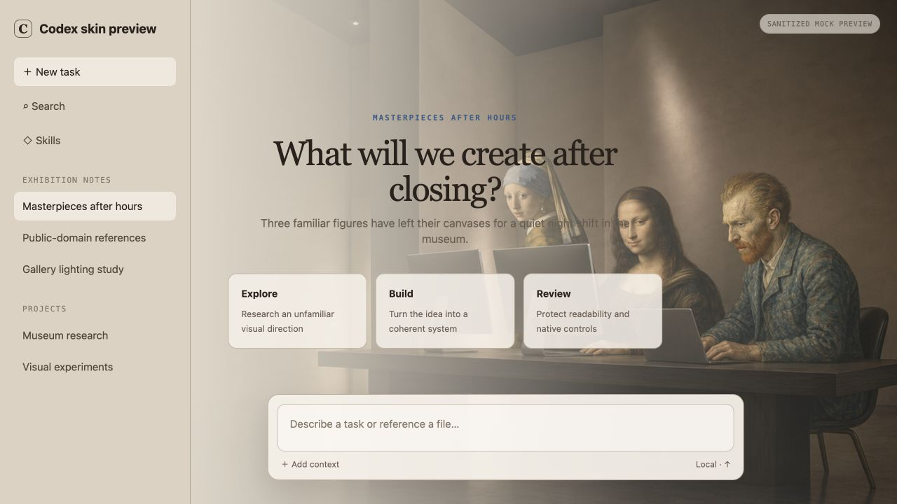

<div align="center">

# Make Codex Skin

### Describe a feeling. Let AI design the skin.

A small, open-source Skill that teaches Codex how to turn an open-ended visual direction into a coherent, readable Codex desktop skin package.

English · [简体中文](./README.zh-CN.md)

</div>



## One repository, one Skill

This repository intentionally contains no website, theme gallery, npm project, installer, injection engine, or catalog of fixed styles.

The Skill helps AI:

- understand a mood, art reference, image, material, or cultural direction;
- synthesize an original visual system instead of choosing a preset style;
- design the palette, surfaces, composition, artwork, typography, and motion together;
- protect the sidebar, task content, code, controls, and composer;
- create a data-only skin folder that can be inspected and shared safely.

It does **not** modify Codex, patch `app.asar`, restart the app, or claim to be an official OpenAI theme system. Live application belongs to a separate trusted renderer and is outside this first public release.

## Install

```bash
git clone https://github.com/1zhangyy1/make-codex-skin.git make-codex-skin-repo
mkdir -p ~/.codex/skills
cp -R make-codex-skin-repo/make-codex-skin ~/.codex/skills/
```

Restart Codex if the new Skill does not appear immediately.

## Use

Ask naturally:

```text
Use $make-codex-skin to create a French romantic skin with the atmosphere
of a quiet Left Bank atelier. Keep it warm, artistic, and easy to read.
```

You can also provide an image, ask for an unfamiliar artistic direction, or ask the Skill to repair an existing skin without erasing its identity.

The result is a folder like this:

```text
my-skin/
├── skin.json
├── preview.png          optional
├── LICENSE.txt          optional
└── assets/
    └── background.png   optional
```

Two inspectable results are included:

- [`make-codex-skin/examples/parisian-atelier`](./make-codex-skin/examples/parisian-atelier/) — a procedural skin derived from a French romantic direction.
- [`make-codex-skin/examples/masterpieces-after-hours`](./make-codex-skin/examples/masterpieces-after-hours/) — an image-based skin derived from “people from famous paintings using computers.”

They demonstrate the workflow; neither is a recipe the AI must follow.

## Image-based example: Masterpieces After Hours

The short request was:

> Make an art-exhibition skin where people from famous paintings are using computers.

The Skill turned it into a museum after closing time, with new interpretations of Mona Lisa, the Girl with a Pearl Earring, and Vincent van Gogh grouped on the right around blank computers. The left side and lower center remain quiet for native Codex content.

The artwork was generated for this project with OpenAI image generation. The figures reinterpret public-domain paintings; no third-party painting files, logos, screen text, or fake UI were embedded. The image asset remains `UNLICENSED` until the creator chooses explicit reuse terms.

The preview above is a sanitized mockup made for the repository. It contains no private Codex tasks and is not proof of official theme support or one-click installation.

## How the Skill thinks

```text
your words or reference
          ↓
understand tone, space, light, material, rhythm
          ↓
synthesize one coherent art direction
          ↓
map it to readable UI and local artwork
          ↓
deliver a data-only skin folder + honest QA notes
```

Creative decisions remain high-freedom. Package structure, readability, rights, and safety remain strict.

## Repository map

```text
make-codex-skin/          the installable Skill, including two examples
docs/                     sanitized README preview
README.md                 English project page
README.zh-CN.md           Chinese project page
LICENSE                   MIT
```

## Current boundary

This v0.1 proves that AI can be taught to design varied Codex skins without a closed menu of visual recipes. It does not yet solve one-click installation or cross-version live rendering.

The output format is an experimental community format, not the official Codex Appearance theme format. Never redistribute artwork, characters, logos, photos, or fonts without the appropriate rights.

## License

The Skill and original documentation are available under the [MIT License](./LICENSE). Example artwork or contributed assets may declare their own license.

“OpenAI” and “Codex” are trademarks of their respective owner. This independent project is not affiliated with, endorsed by, or supported by OpenAI.
