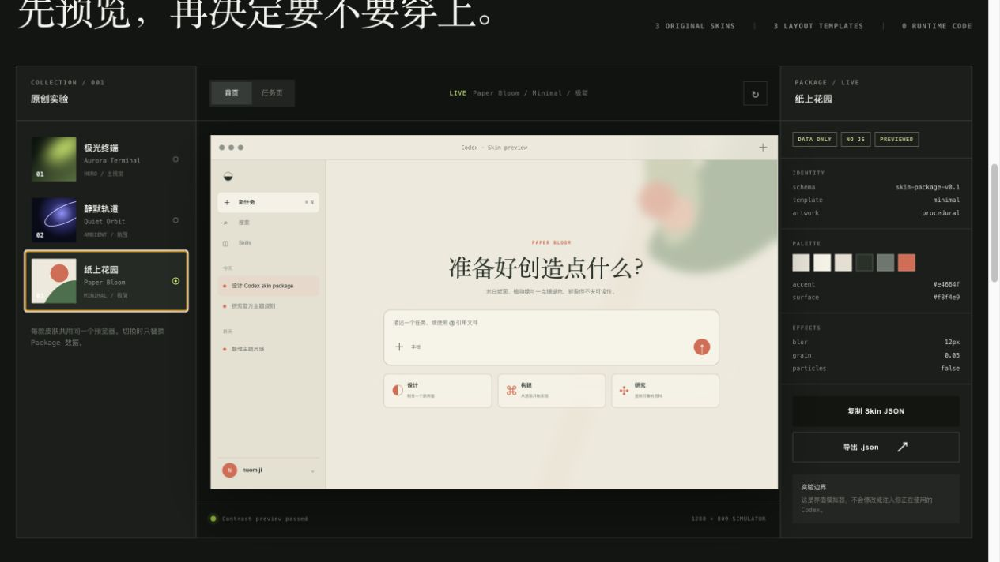

<div align="center">

# Make Codex Skin

### 描述一种感觉，让 AI 把它设计成皮肤。

一个小而清楚的开源 Skill：教 Codex 把开放的视觉描述变成完整、可读的 Codex 桌面皮肤包。

[English](./README.md) · 简体中文

</div>



## 一个仓库，只做一个 Skill

这个仓库刻意不包含网站、皮肤聚合站、npm 工程、安装器、注入引擎，也不提供固定风格菜单。

这个 Skill 教会 AI：

- 理解用户描述的情绪、艺术参考、图片、材质与文化线索；
- 自主形成视觉方向，而不是从几种预设风格里挑一个；
- 让配色、界面材质、构图、图片、字体与动效属于同一个系统；
- 保护侧边栏、任务内容、代码、控件和输入框的可用性；
- 生成可以检查和分享的纯数据皮肤文件夹。

它**不会**修改 Codex、替换 `app.asar`、重启应用，也不会把自己描述成 OpenAI 官方主题系统。真实应用皮肤需要独立可信的渲染器，不属于第一版开源范围。

## 安装

```bash
git clone https://github.com/1zhangyy1/make-codex-skin.git make-codex-skin-repo
mkdir -p ~/.codex/skills
cp -R make-codex-skin-repo/make-codex-skin ~/.codex/skills/
```

如果没有立刻看到新 Skill，重新启动一次 Codex。

## 使用

直接描述你想要的感觉：

```text
使用 $make-codex-skin 做一个法式浪漫、有艺术气息的皮肤。
像一间安静的左岸工作室，温暖、细腻，同时适合长时间阅读。
```

你也可以提供图片、提出从未出现过的艺术方向，或者让 Skill 修复一个已有皮肤，同时保留它原本的个性。

结果是一个简单的文件夹：

```text
my-skin/
├── skin.json
├── preview.png          可选
├── LICENSE.txt          可选
└── assets/
    └── background.png   可选
```

[`examples/parisian-atelier`](./examples/parisian-atelier/) 是一次真实生成结果。它只是案例，不是要求 AI 套用的配方。

## Skill 如何思考

```text
用户语言或参考图
        ↓
理解情绪、空间、光线、材质和节奏
        ↓
综合成一个连贯的艺术方向
        ↓
映射为可读的界面与本地素材
        ↓
交付纯数据皮肤文件夹与诚实的 QA 结果
```

创作判断保持高自由度；文件结构、可读性、素材权利和安全边界保持严格。

## 仓库结构

```text
make-codex-skin/          可以安装的 Skill
examples/                 一个可检查的输出案例
docs/                     一张脱敏 README 图片
README.md                 英文项目介绍
README.zh-CN.md           中文项目介绍
LICENSE                   MIT
```

## 当前边界

v0.1 先验证一件事：AI 能否在没有固定视觉配方菜单的情况下，学会设计多样的 Codex 皮肤。它暂时不解决一键安装，也不承诺跨版本实时渲染。

输出格式是实验性的社区格式，不是 Codex 官方 Appearance 主题格式。没有明确授权时，不要分发角色、品牌、照片、字体或其他受保护素材。

## 许可证

Skill 与原创文档采用 [MIT License](./LICENSE)。独立案例或社区贡献的素材可以声明自己的许可证。

“OpenAI”和“Codex”是其权利人的商标。本项目是独立社区项目，与 OpenAI 没有隶属、背书或官方支持关系。
